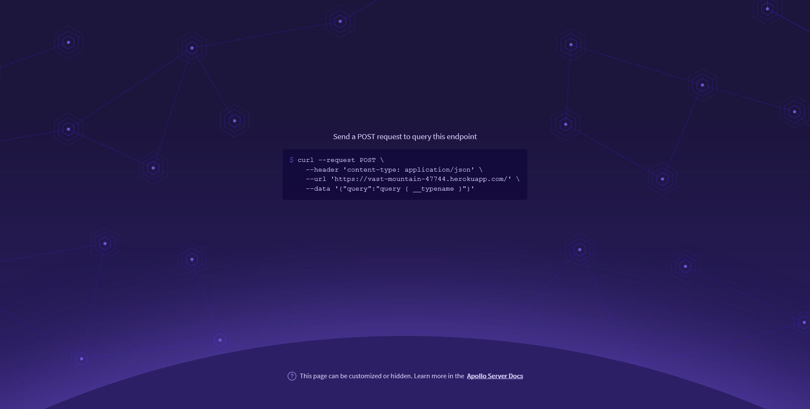

# MERNG-SocialMedia
<!-- PROJECT LOGO -->
<br />
<p align="center">
  <a href="https://github.com/github_username/repo_name">
    
  </a>

  <h2 align="center">MERNG Social Media App</h2>

  <p align="center">
    A fully operational Social Media App with CRUD post functionalities, user verification and authentication using JWT, developed using
    MongoDB
    ExpressJs
    ReactJs
    NodeJs
    GraphQL
    <br />
    <a href="https://github.com/Ayush6501/MERNG-SocialMedia"><strong>Explore the docs »</strong></a>
    <br />
    <a href="https://vast-mountain-47744.herokuapp.com/"><strong>The server »</strong></a>
    <br />
    <a href="https://reverent-einstein-de1ea3.netlify.app/">View Demo</a>
    ·
    <a href="https://github.com/Ayush6501/MERNG-SocialMedia">Report Bug</a>
    ·
    <a href="https://github.com/Ayush6501/MERNG-SocialMedia/issues">Request Feature</a>
  </p>
</p>


<!-- TABLE OF CONTENTS -->
<details open="open">
  <summary><h2 style="display: inline-block">Table of Contents</h2></summary>
  <ol>
    <li>
      <a href="#about-the-project">About The Project</a>
      <ul>
        <li><a href="#built-with">Built With</a></li>
      </ul>
    </li>
    <li>
      <a href="#getting-started">Getting Started</a>
      <ul>
        <li><a href="#prerequisites">Prerequisites</a></li>
        <li><a href="#installation">Installation</a></li>
      </ul>
    </li>
    <li><a href="#screenshots">Screenshots</a></li>
    <li><a href="#inspiration">Inspiration</a></li>
    <li><a href="#license">License</a></li>
    <li><a href="#contact">Contact</a></li>
  </ol>
</details>


<!-- ABOUT THE PROJECT -->
## About The Project

This is a Full Stack Social Media App, with additional authentication features using graphQL and JWT which'll allow users
to login with their credentials, create, edit and delete posts as well as like them and add comments.

### Built With

* MongoDB
* ExpressJS
* ReactJS
* NodeJs
* GraphQL
* Semantic UI
* Bcrypt
* JWT


<!-- GETTING STARTED -->
## Getting Started

To get a local copy up and running follow these simple steps.

### Prerequisites

This is an example of how to list things you need to use the software and how to install them.
* npm
  ```sh
  npm install npm@latest -g
  ```

### Installation

1. Clone the repo
   ```sh
   git clone https://github.com/Ayush6501/react-disneyplus-clone.git
   ```
2. Install NPM packages 
   ```sh
   npm install
   ```
3. Start the server 
   ```sh
   npm run serve
   ```
4. Navigate to client folder
   ```sh
   cd client
   ```
5. Install NPM packages 
   ```sh
   npm install
   ```
6. Start the localhost server for the client interface
   ```sh
   npm start
   ```

<!-- SC EXAMPLES -->
## Screenshots

1. The Server Page

2. Home Page

3. Login Page

2. Posts Page

3. Comment Page


<!-- Inspiration -->
## Inspiration

This site has been inspired by the various social media platform such as Twitter, Facebook, Instagram etc.


<!-- CONTRIBUTING -->
## Contributing

Contributions are what make the open source community such an amazing place to learn, inspire, and create. Any contributions you make are **greatly appreciated**.

1. Fork the Project
2. Create your Feature Branch (`git checkout -b feature/AmazingFeature`)
3. Commit your Changes (`git commit -m 'Add some AmazingFeature'`)
4. Push to the Branch (`git push origin feature/AmazingFeature`)
5. Open a Pull Request


<!-- LICENSE -->
## License

Distributed under the MIT License. See `LICENSE` for more information.


<!-- CONTACT -->
## Contact

Ayush Majumdar - [@email](ayushmajumdar6501@gmail.com)

Project Link: https://github.com/Ayush6501/MERNG-SocialMedia

Website Link(CLIENT): https://reverent-einstein-de1ea3.netlify.app/

Website Link(SERVER): https://vast-mountain-47744.herokuapp.com/
